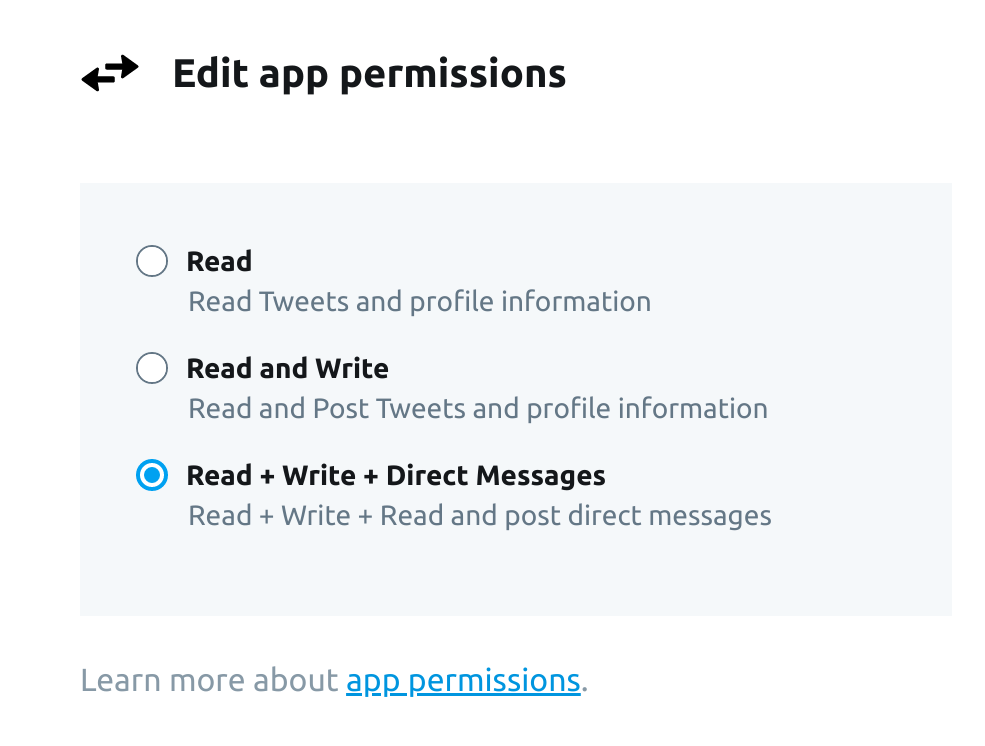
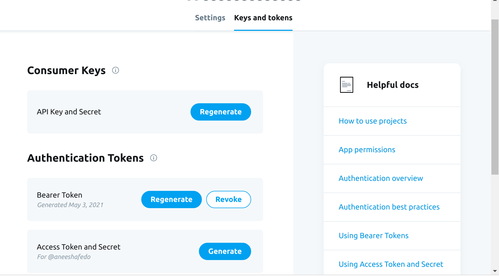

# Ballerina Twitter Connector
Connects to Twitter using Ballerina.

# Introduction
The Twitter API can be used to programmatically retrieve and analyze data, as well as engage with the conversation on Twitter.
This connector provides access to a variety of different resources in Twitter including the following:
* Tweets
* Users
 
The Twitter API currently consists of two supported versions, as well as different access tiers.
When user wants to access Twitter through Ballerina Twitter Connector, they are required to register an application. By default, applications can only access public information on Twitter. Certain operations, such as those responsible for sending or receiving Direct Messages and posting a Tweet, require additional permissions from user before access user information. These permissions are not granted by default; you choose on a per-application basis whether to provide this access, and can control all the applications authorized on your account.

## What is Twitter?
Twitter is a social networking service on which users can post and communicate with status called as "Tweets". Authenticated users can post, like, and retweet tweets.  Main use case is to connect people and allow people to express their thoughts to large set of people.

## Key Features of Twitter
* Create and manage Tweet, Retweet and Reply
* Manage Users and their details

# Supported Versions & Limitations

## Supported Versions

|                                   | Version               |
|:---------------------------------:|:---------------------:|
|       Twitter API Version         |         v1.1          |
|       Ballerina Language          |   Swan Lake Alpha 5   |

## Limitations

The connector doesn't support all the operations offered by Twitter API V1.1.

## Prerequisites
**Step 1:** Apply for a developer account and receive approval.
https://developer.twitter.com/en/apply-for-access
**Step 2:** Create a project and an associated developer App in the developer portal.
https://developer.twitter.com/en/portal/dashboard
**Step 3:** In App permissions you have to give permission of Read, write and access Direct Messages. If a permission level is changed, any user tokens already given to that Twitter app must be revoked and users should authorize the App again in order for the token to acquire the latest permissions.

**Step 4:** In the app created go to  “Keys and tokens” tab and save your API Key, API Secret, Access Tokens and Access Token Secret in a trusted place as they are not visible after. If you lost those keys and secrets regenerate those.

**Step 5:** Then in App settings you have to enable 3-legged OAuth

**Add project configurations file**

Add the project configuration file by creating a `Config.toml` file under the root path of the project structure.
This file should have following configurations. Add the tokens obtained in the previous step to the `Config.toml` file.

## Connector Overview

In order to use the Twitter Connector, first you need to create a Twitter Client endpoint.

```ballerina
twitter:TwitterConfiguration twitterConfig = {
    clientId: "<clientId>",
    clientSecret: "<clientSecret>",
    accessToken: "<accessToken>",
    accessTokenSecret: "<accessTokenSecret>"
};

twitter:Client twitterClient = check new(twitterConfig);
```

#### Example

##### Post tweet

```ballerina
import ballerina/io;
import ballerinax/twitter;

twitter:TwitterConfiguration twitterConfig = {
    clientId: "<clientId>",
    clientSecret: "<clientSecret>",
    accessToken: "<accessToken>",
    accessTokenSecret: "<accessTokenSecret>"
};

twitter:Client twitterClient = check new(twitterConfig);

public function main() {
    string tweetContent = "Sample tweet";
    var result = twitterClient->tweet(tweetContent);
    if (result is twitter:Tweet) {
        io:println("Tweet: ", result.toString());
    } else {
        io:println("Error: ", result.toString());
    }
}
```
##### Search using a string

```ballerina
import ballerina/io;
import ballerinax/twitter;

twitter:TwitterConfiguration twitterConfig = {
    clientId: "<clientId>",
    clientSecret: "<clientSecret>",
    accessToken: "<accessToken>",
    accessTokenSecret: "<accessTokenSecret>"
};

twitter:Client twitterClient = check new(twitterConfig);

public function main() {
    string queryStr = "SriLanka";
    twitter:SearchOptions request = {
        count: 10
    };

    twitter:Tweet[]|error response = twitterClient->search(queryStr, request);
    if (response is twitter:Tweet[]) {
        log:printInfo("Statuses Details: " + response.toString());
    } else {
        log:printError("Error: " + response.toString());
    }
}
```
##### Get tweets in user timeline

```ballerina
import ballerina/io;
import ballerinax/twitter;

twitter:TwitterConfiguration twitterConfig = {
    clientId: "<clientId>",
    clientSecret: "<clientSecret>",
    accessToken: "<accessToken>",
    accessTokenSecret: "<accessTokenSecret>"
};

twitter:Client twitterClient = check new(twitterConfig);

public function main() {
    twitter:Tweet[]|error response = twitterClient->getUserTimeline();
    if (response is twitter:Tweet[]) {
        log:printInfo("Statuses Details: " + response.toString());
    } else {
        log:printError("Error: " + response.toString());
    }
}
```
##### Get user

```ballerina
import ballerina/io;
import ballerinax/twitter;

twitter:TwitterConfiguration twitterConfig = {
    clientId: "<clientId>",
    clientSecret: "<clientSecret>",
    accessToken: "<accessToken>",
    accessTokenSecret: "<accessTokenSecret>"
};

twitter:Client twitterClient = check new(twitterConfig);

public function main() {
    twitter:User|error response = twitterClient->getUser(userId);
    if (response is twitter:User) {
        log:printInfo("User Details: " + response.toString());
    } else {
        log:printError("Error: " + response.toString());
    }
}
```

### Building the Source

Execute the commands below to build from the source after installing Ballerina SLAlpha5 version.

1. To clone the repository:
Clone this repository using the following command:
```shell
    git clone https://github.com/ballerina-platform/module-ballerinax-twitter
```
Execute the commands below to build from the source after installing Ballerina SwanLake Alpha 5 version.

2. To build the library:
Run this command from the module-ballerinax-twitter root directory:
```shell script
    bal build
```

3. To build the module without the tests:
```shell script
    bal build -c --skip-tests
```

## Contributing to Ballerina

As an open source project, Ballerina welcomes contributions from the community. 

For more information, go to the [contribution guidelines](https://github.com/ballerina-platform/ballerina-lang/blob/master/CONTRIBUTING.md).

## Code of Conduct

All the contributors are encouraged to read the [Ballerina Code of Conduct](https://ballerina.io/code-of-conduct).

## Useful Links

* Discuss the code changes of the Ballerina project in [ballerina-dev@googlegroups.com](mailto:ballerina-dev@googlegroups.com).
* Chat live with us via our [Slack channel](https://ballerina.io/community/slack/).
* Post all technical questions on Stack Overflow with the [#ballerina](https://stackoverflow.com/questions/tagged/ballerina) tag.

## How you can contribute

Clone the repository by running the following command
`git clone https://github.com/ballerina-platform/module-ballerinax-twitter.git`

As an open source project, we welcome contributions from the community. Check the [issue tracker](https://github.com/ballerina-platform/module-ballerinax-twitter/issues) for open issues that interest you. We look forward to receiving your contributions.
